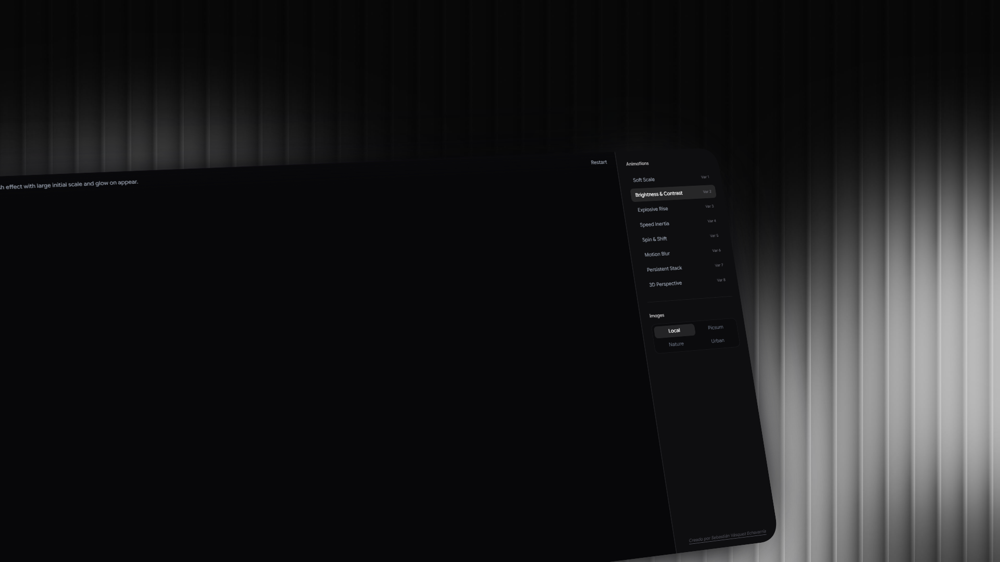

# 🌌 Interactive Image Trail Showcase



An interactive, high-performance image trail application built with **React**, **GSAP (GreenSock Animation Platform)**, and **Tailwind CSS v4**. This application showcases 8 distinct interactive mouse/touch trail effects, leveraging physics, inertial damping, 3D rotations, and CSS filters to create premium user experiences.

---

## 🚀 Key Features

*   **8 Animation Variants:**
    1.  **Escala Suave (Smooth Scale):** Images scale down smoothly as they fade with cursor motion.
    2.  **Brillo & Contraste (Flash & Glow):** Vibrant flash effect with initial large scale and brightness boost.
    3.  **Ascenso Explosivo (Explosive Ascent):** Images float rapidly upwards with random scattering angles.
    4.  **Inercia de Velocidad (Speed Inertia):** Warp deformation and chromatic flash proportional to cursor speed.
    5.  **Giro & Desplazamiento (Rotation & Offset):** Active rotation and stretching aligned with the physical cursor vector.
    6.  **Desenfoque de Movimiento (Motion Blur):** Simulates radial blur and desaturation matching cursor speed.
    7.  **Pila Persistente (Persistent Stack):** Maintains an active queue of up to 9 images that age and fade in sequence.
    8.  **Perspectiva 3D (3D Perspective):** Interactive three-dimensional rotations relative to the screen center.
*   **Dynamic Theme & Glassmorphism UI:** Built with sleek dark-mode aesthetics, glowing borders, and modern fonts (Google Sans Flex / Outfit).
*   **Fully Responsive & Touch Enabled:** Supports mobile gestures (`touchmove` / `touchstart`) for seamless interaction on mobile screens.
*   **Clean Architecture:** Object-oriented classes for trail handlers matching high performance patterns.

---

## 🛠️ Tech Stack

*   **Frontend Library:** [React](https://react.dev/) (v19)
*   **Animation Engine:** [GSAP (GreenSock)](https://gsap.com/) (v3)
*   **Styling & Design System:** [Tailwind CSS v4](https://tailwindcss.com/)
*   **Build Tool & Dev Server:** [Vite](https://vite.dev/)

---

## 📦 Getting Started

### Prerequisites

Ensure you have [Node.js](https://nodejs.org/) installed (v18+ recommended).

### Installation

1. Clone the repository:
   ```bash
   git clone https://github.com/your-username/image-trail.git
   cd image-trail
   ```

2. Install dependencies:
   ```bash
   npm install
   ```

3. Run the local development server:
   ```bash
   npm run dev
   ```

4. Build for production:
   ```bash
   npm run build
   ```

---

## 📁 Project Structure

```text
├── src/
│   ├── assets/           # Static asset assets
│   ├── ImageTrail.jsx    # Core component containing the 8 GSAP trail variants
│   ├── App.jsx           # Sidebar controller, category switcher, and main app container
│   ├── App.css           # Local layout styling
│   ├── index.css         # Tailwind directives & typography settings
│   └── main.jsx          # Entry point
├── index.html            # HTML Shell
├── package.json          # Dependency and script definitions
└── vite.config.js        # Vite configuration
```

---

## 📄 License

This project is licensed under the MIT License. Feel free to use and modify it for your own portfolios!
